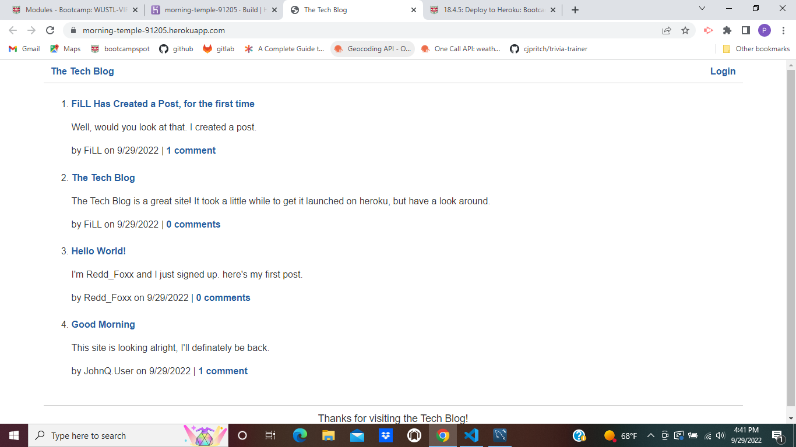

# MVC-TechBlog 

## Description

The Tech Blog is a CMS-style blog site where users can post messages, and comment on other users posts.

##Table of Contents
-[Installation](#installation)
-[Usage](#usage)
-[Credits](#credits)
-[License](#license)
-[Questions](#questions)
-[Contribution](#contribution)

## Installation

This app is hosted on heroku:
https://morning-temple-91205.herokuapp.com/

## Usage

Users signup, login, and start posting their thoughts on tech.

## License

This project is covered under the following license:  MIT

## Contribution

## Questions

If you have any questions regarding this application, please direct them to
EMAIL:  philbranch243@gmail.com
GITHUB:  PBranch243
